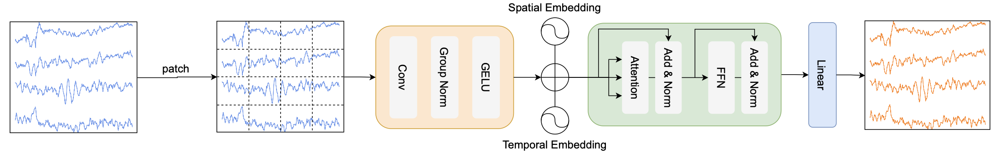
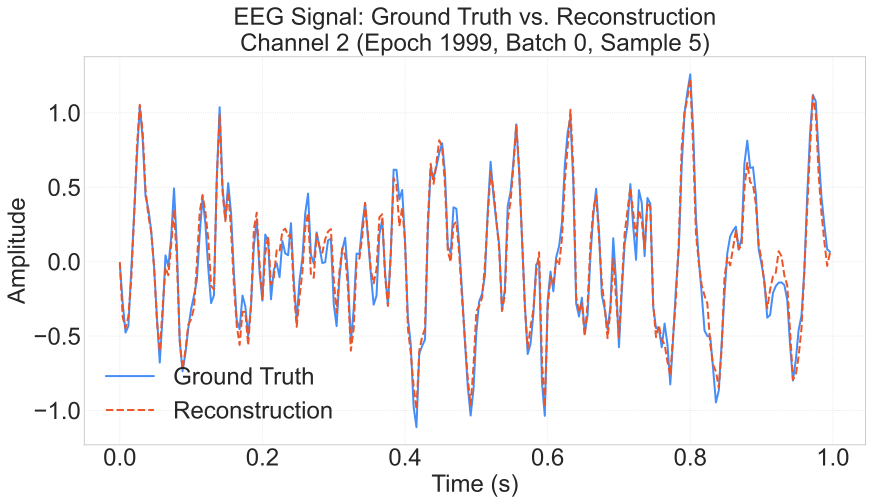
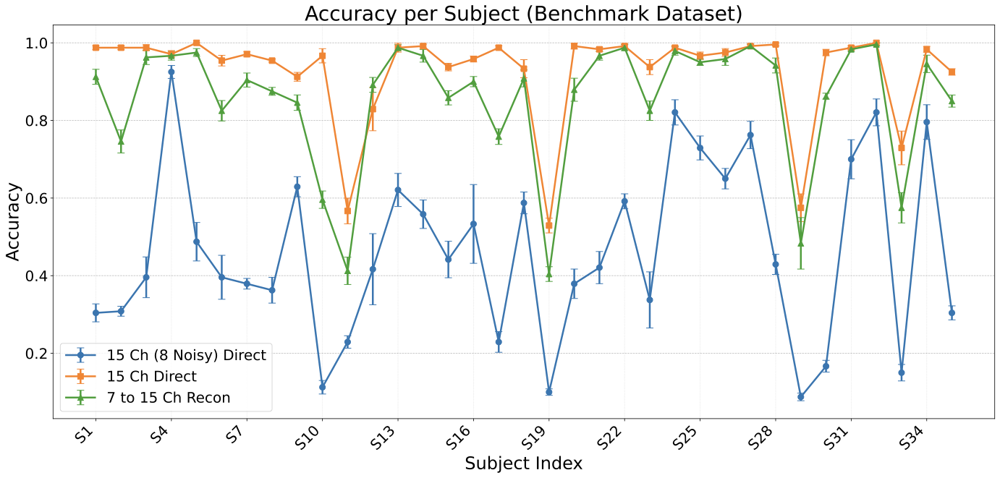

# Enhancing Brain-Computer Interface Performance via Self-Supervised EEG Super-Resolution

[](https://www.python.org/downloads/release/python-380/)
[](https://pytorch.org/)
[](LICENSE)

## Overview

This repository contains the official implementation of **"Enhancing Brain-Computer Interface Performance via Self-Supervised EEG Super-Resolution"**. 

Brain-Computer Interface (BCI) systems often face a trade-off between signal quality and practicality. Increasing the number of electroencephalography (EEG) electrodes typically improves decoding performance by providing higher spatial resolution, but it also results in longer preparation times, increased system complexity, and higher cost. This work aims to address this challenge by investigating whether EEG signals recorded from a limited number of channels can be used to reconstruct higher-density EEG representations.

### Key Features

- **Self-supervised learning** framework for EEG super-resolution
- **Transformer-based architecture** adapted for temporal EEG data
- **Random masking pretraining** paradigm inspired by BERT
- **Spatial and temporal embeddings** for EEG patch processing
- Support for **SSVEP BCI** classification tasks
- Comprehensive evaluation on **THU SSVEP Benchmark** dataset

## Model Architecture

Our approach employs a Transformer-based framework with the following components:

1. **EEG Patch Processing**: EEG signals are divided into patches and processed as input units
2. **Spatial and Temporal Embeddings**: Special attention to both spatial and temporal characteristics
3. **Random Masking Strategy**: Self-supervised pretraining with random patch masking
4. **Super-Resolution Decoder**: Reconstructs high-density EEG from sparse electrode data


## Installation

### Option 1: Using Conda (Recommended)

1. Clone the repository:
```bash
git clone https://github.com/DayBright-David/EEG-Super-Resolution.git
cd EEG-Super-Resolution
```

2. Create and activate conda environment:
```bash
conda env create -f ssvep_sr.yml
conda activate ssvep_sr
```

### Option 2: Using pip

1. Clone the repository:
```bash
git clone https://github.com/DayBright-David/EEG-Super-Resolution.git
cd EEG-Super-Resolution
```

2. Install dependencies:
```bash
pip install -r requirements.txt
```

3. Install the package in development mode:
```bash
pip install -e .
```

### Option 3: Using the experiment runner (Easiest)

```bash
# Set up everything automatically
./scripts/run_experiments.sh setup
```

## Dataset Preparation

Download the THU SSVEP Benchmark Dataset from [here](https://bci.med.tsinghua.edu.cn/) and place it in the dataset folder:
```
dataset/
└── Benchmark/
    ├── S1.mat
    ├── S2.mat
    ├── ...
    └── S35.mat
```

## Quick Start

### Option 1: Using the experiment runner (Recommended)

```bash
# Run a quick demo
./scripts/run_experiments.sh demo

# Run pretraining for a single subject
./scripts/run_experiments.sh pretrain 1

# Run evaluation
./scripts/run_experiments.sh evaluate

# Run SSVEP experiments
./scripts/run_experiments.sh ssvep

# Run complete pipeline
./scripts/run_experiments.sh all
```

### Option 2: Manual execution

#### 1. Pretraining

```bash
# Single GPU training
python scripts/run_labram_pretraining.py \
    --output_dir ./checkpoints/labram_base \
    --log_dir ./logs/labram_base \
    --model reconstruction_base_patch250_250 \
    --batch_size 1000 \
    --lr 5e-3 \
    --epochs 2000

# Multi-GPU training
torchrun --nproc_per_node=2 scripts/run_labram_pretraining.py \
    --output_dir ./checkpoints/labram_base \
    --log_dir ./logs/labram_base \
    --model reconstruction_base_patch250_250 \
    --batch_size 1000 \
    --lr 5e-3 \
    --epochs 2000
```

#### 2. Evaluation

```bash
# Test on same data distribution as pretraining
python scripts/test_pretrain_on_pretrain_data.py \
    --model reconstruction_base_patch250_250 \
    --checkpoint_path ./checkpoints/labram_base \
    --epochs 1004

# Test on different subjects
python scripts/test_pretrain_on_finetune_data.py \
    --model reconstruction_base_patch250_250 \
    --checkpoint_path ./checkpoints/labram_base \
    --epochs 1004 \
    --sub 1
```

#### 3. SSVEP Classification

```bash
# Standard TDCA (baseline)
python scripts/train_ssvep_tdca_test_channel_attack_multi_time_n_fold.py \
    --model reconstruction_base_patch250_250 \
    --pretrain_checkpoint_path ./checkpoints/labram_base \
    --checkpoint_epoch 1999

# With super-resolution enhancement
python scripts/train_ssvep_tdca_test_channel_attack_multi_time_n_fold.py \
    --model reconstruction_base_patch250_250 \
    --pretrain_checkpoint_path ./checkpoints/labram_base \
    --checkpoint_epoch 1979 \
    --use_super_resolution
```

### Option 3: Using the Python API

```python
# Quick demo using the Python API
python examples/quick_start.py
```

## Testing

Run the test suite to verify installation:

```bash
python tests/test_basic.py
```

Or using pytest:

```bash
pytest tests/ -v
```

## Project Structure

```
eeg-super-resolution/
├── README.md                  # This file
├── LICENSE                    # MIT license
├── setup.py                   # Package installation
├── requirements.txt           # Python dependencies
├── .gitignore                # Git ignore rules
├── configs/
│   └── default_config.yaml   # Configuration file
├── env/
│   └── ssvep_sr.yml          # Conda environment file
├── src/                      # Core source code
│   ├── __init__.py
│   ├── modeling_pretrain.py  # Main model architecture
│   ├── dataset.py           # Dataset processing
│   ├── utils.py             # Utility functions
│   ├── engine_for_pretraining.py  # Training engine
│   ├── optim_factory.py     # Optimizer utilities
│   └── norm_ema_quantizer.py # Quantization utilities
├── scripts/                  # Executable scripts
│   ├── run_experiments.sh    # Main experiment runner
│   ├── run_labram_pretraining.py
│   ├── run_labram_finetune.py
│   ├── test_pretrain_on_pretrain_data.py
│   └── train_ssvep_tdca_test_channel_attack_multi_time_n_fold.py
├── examples/                 # Usage examples
│   └── quick_start.py       # Quick start demonstration
├── tests/                   # Unit tests
│   └── test_basic.py       # Basic functionality tests
├── plot/                   # Visualization tools
│   ├── visualize_reconstruction.py
│   ├── visualize_experiment_results.py
│   └── plot_methods.py
├── dataset/                # Place your dataset here
├── checkpoints/           # Model checkpoints (created automatically)
├── logs/                 # Training logs (created automatically)
└── results/             # Experiment results (created automatically)
```

## Configuration

The project uses YAML configuration files for easy parameter management. Edit `configs/default_config.yaml` to customize:

- Model architecture parameters
- Training hyperparameters
- Dataset settings
- Experiment configuration

## Results

Our experiments on the THU SSVEP Benchmark demonstrate:

- **High-fidelity reconstruction**: The super-resolved EEG data achieves waveform reconstruction accuracy approaching full 15-channel montage

- **Super-resolution for SSVEP BCI**: Enables high-performance SSVEP BCI with reduced electrode setup complexity

## Contributing

We welcome contributions! Please see our [Contributing Guidelines](CONTRIBUTING.md) for details.

## Citation

If you use this code in your research, please cite our work:

```bibtex
@article{dai2024enhancing,
  title={Enhancing Brain-Computer Interface Performance via Self-Supervised EEG Super-Resolution},
  author={Dai, Bo and Mou, Xinyu and Zhang, Xinyuan and Zhang, ShanGen and Gao, Xiaorong},
  journal={中国生物医学工程大会},
  year={2025}
}
```

## License

This project is licensed under the MIT License - see the [LICENSE](LICENSE) file for details.

## Acknowledgments

- [Labram](https://github.com/935963004/LaBraM)
- [THU SSVEP Benchmark](https://bci.med.tsinghua.edu.cn/)
- PyTorch and timm libraries

## Support

- 🐛 [Issue Tracker](https://github.com/DayBright-David/EEG-Super-Resolution/issues)
- 💬 [Discussions](https://github.com/DayBright-David/EEG-Super-Resolution/discussions)

For questions or issues, please open an issue on GitHub or contact the authors.